# Windows Domain Support Lab

**Name:** Vulkan
**GitHub:** TheBoochy
**Project:** Windows Domain Support Lab
**Focus:** Windows client administration, Active Directory support, domain login testing, shared folders, printers, Group Policy and troubleshooting

---

## Work log

### 2026-06-22

**Worked on:**
Project setup, Windows client installation, DNS configuration, domain join, domain user login testing, shared folder access testing, permission troubleshooting, printer connection testing, basic Group Policy testing and troubleshooting support case documentation.

**What I did:**
I created the project folder, prepared the folder structure, started the README file and started the logbook for the Windows Domain Support Lab.

I created a Windows 11 Pro client virtual machine named `client-win01` in VMware. The VM was configured with NAT networking so it could communicate with the existing Björklunda Admin Lab servers. After installation, I created a local account named `Vulkan`, verified the hostname, checked the logged-in user and confirmed the network configuration with `ipconfig /all`.

I configured the client DNS settings so that `client-win01` uses the domain controller `srv-dc01` as DNS server. The DNS server was set to `192.168.80.12`. I verified domain controller discovery with `nslookup`, SRV record lookup and `nltest /dsgetdc:bjorklunda.local`.

After DNS was working, I joined `client-win01` to the `bjorklunda.local` Active Directory domain. The first domain join attempt failed because the username format was not accepted. I solved this by using the user principal name format `administrator@bjorklunda.local`, which worked. The client successfully joined the domain and was restarted.

After the restart, I verified that the client belonged to the domain and then logged in with the domain user `bjorklunda\it.user01`. I confirmed the login with `whoami`, `hostname` and `systeminfo`.

I then tested shared folder access. The IT user could access `\\srv-dc01\IT` and create a test file, which confirmed that the IT share access worked. When testing `\\srv-dc01\Finance`, the IT user unexpectedly had access to the Finance share. I investigated the issue by checking saved credentials, group membership, NTFS permissions and SMB share permissions.

The group membership showed that `it.user01` belonged to `BJORKLUNDA\GG_IT_Users` and not to `BJORKLUNDA\GG_Finance_Users`. This confirmed that the issue was not caused by incorrect group membership. On `srv-dc01`, I found that the Finance folder still had broad inherited `BUILTIN\Users` permissions and the Finance SMB share had `Everyone` with Full access. I fixed this by disabling inheritance, removing `BUILTIN\Users`, granting Modify permission to `BJORKLUNDA\GG_Finance_Users`, granting the Finance group Change permission on the SMB share and removing `Everyone` from the share permissions.

After the permissions were fixed, I retested from `client-win01` as `bjorklunda\it.user01`. The IT user was denied access to `\\srv-dc01\Finance`, which confirmed that the Finance permissions were now working correctly.

I also tested printer access from the domain client. While logged in as `bjorklunda\it.user01`, I connected to the shared printer `\\srv-dc01\Bjorklunda-Test-Printer`. Windows displayed an administrator prompt for printer driver installation, which I approved with the domain administrator account. After installation, the shared printer queue opened successfully, `Get-Printer` showed the printer connection, and Windows Settings showed `Bjorklunda-Test-Printer on srv-dc01` under Printers & scanners.

I then created and tested a basic Group Policy Object. On `srv-dc01`, I created the GPO `GPO_Block_Control_Panel_For_Users` and linked it to the `Bjorklunda` OU. In the GPO, I enabled the user policy `Prohibit access to Control Panel and PC settings`. On `client-win01`, I forced a Group Policy update with `gpupdate /force`, tested that Control Panel access was blocked for `bjorklunda\it.user01`, and verified the applied policy with `gpresult /r`.

I also created a troubleshooting support cases document named `docs/support_cases.md`. The document describes realistic Windows domain support cases from the lab, including DNS and domain controller discovery issues, domain join username format problems, shared folder permission testing, Finance share troubleshooting, printer driver approval behavior and Group Policy restrictions. The purpose of this document is to show how the lab can be used from a support technician perspective, not only as a configuration exercise.

**Problems and solutions:**
During the Windows 11 installation, VMware required encryption for the virtual TPM. I selected encryption only for the files needed to support the virtual TPM instead of encrypting the whole VM.

The VM location initially pointed to OneDrive. I changed the VM storage location before finishing the VM creation because virtual machines should not be stored inside OneDrive sync folders. This avoids sync problems, file locking and unnecessary performance issues.

During Windows setup, Microsoft tried to guide the setup toward a work or school Microsoft sign-in. I used the local account option instead, because this lab uses a local Active Directory domain and not Microsoft cloud identity.

The first domain join attempt failed with the message that the specified username was invalid. I solved this by using the credential format `administrator@bjorklunda.local` instead of the first attempted format.

The Finance share test showed an unexpected access problem. The IT user could open the Finance share even though the user was not a member of the Finance group. I checked `cmdkey /list` to rule out cached administrator credentials. Then I checked `whoami /groups` and confirmed that the user only belonged to `GG_IT_Users`. On the server side, I found broad NTFS and SMB permissions. I fixed the issue by removing broad user permissions and restricting the Finance share to `BJORKLUNDA\GG_Finance_Users`.

During printer connection testing, Windows displayed a User Account Control prompt for printer driver software installation. This was expected because the normal domain user did not have permission to install the printer driver without elevation. I solved this by entering the domain administrator credentials for the driver installation.

During Group Policy testing, the policy needed to be forced on the client before the result could be tested immediately. I solved this by running `gpupdate /force` on `client-win01` and then checking the applied policy with `gpresult /r`.

While creating the support cases document, I focused on turning the actual lab problems into clear helpdesk-style cases. This made the documentation more realistic because it shows symptoms, likely causes, troubleshooting steps, solutions and results.

**Decisions I made:**
I decided to use Windows 11 Pro for the client because Windows Pro supports Active Directory domain join. I kept the client IP address on DHCP but manually set DNS to the domain controller address `192.168.80.12`, because Active Directory domain join depends on correct DNS resolution.

I used `it.user01` as the first test user because the IT share was a clear permission test case. I also kept the unexpected Finance access as troubleshooting evidence because it shows realistic support and administration work instead of only showing the final successful state.

For the printer test, I used the existing shared printer from `srv-dc01` instead of creating a new printer. This kept the project focused on client-side support testing and showed how a normal domain user experiences connecting to a shared printer.

For the Group Policy test, I chose a simple visible policy that blocks Control Panel and Settings for users. This made it easy to prove that the domain policy was applied to the client without making risky changes to the system.

For the troubleshooting documentation, I decided to use cases that were already proven during the lab. This kept the document realistic and avoided inventing problems that were not actually tested.

**Sources I used:**

* Previous Björklunda Admin Lab environment
* Microsoft documentation about Windows client domain join and Active Directory basics
* Microsoft documentation about NTFS permissions and SMB share permissions
* Microsoft documentation about Windows command-line tools such as `ipconfig`, `whoami`, `nslookup`, `nltest`, `icacls` and SMB share cmdlets
* Microsoft documentation about Group Policy tools such as `gpupdate` and `gpresult`
* Lab screenshots and test results from `client-win01` and `srv-dc01`

---

## Part 1 — Repository setup and project planning

In this part I created the local project structure for the Windows Domain Support Lab.

The project continues from the Björklunda Admin Lab server environment. The previous lab created the server side with Active Directory, DNS, users, groups, shared folders and a shared printer. This new lab focuses on the client and support side.

The main goal is to add a Windows client computer to the domain and test common support tasks such as login, shared folder access, printer access, Group Policy and troubleshooting.

### Folder structure

The project folder is:

`Windows-Domain-Support-Lab`

The folder structure is:

| Folder or file | Purpose                           |
| -------------- | --------------------------------- |
| `docs/`        | Extra project documentation       |
| `screenshots/` | Screenshot evidence               |
| `scripts/`     | PowerShell scripts                |
| `results/`     | Test output and exported results  |
| `logbook.md`   | Main step-by-step project logbook |
| `README.md`    | GitHub project overview           |

### Planned lab systems

| System         | Role                                                        |
| -------------- | ----------------------------------------------------------- |
| `srv-dc01`     | Domain controller, DNS server, file server and print server |
| `client-win01` | Windows client computer joined to the domain                |

### Planned project parts

| Part    | Topic                           |
| ------- | ------------------------------- |
| Part 1  | Repository setup and planning   |
| Part 2  | Windows client VM installation  |
| Part 3  | Network and DNS configuration   |
| Part 4  | Domain join                     |
| Part 5  | Domain user login testing       |
| Part 6  | Shared folder access testing    |
| Part 7  | Printer connection testing      |
| Part 8  | Basic Group Policy              |
| Part 9  | Troubleshooting support cases   |
| Part 10 | Security and support reflection |
| Part 11 | Final README and GitHub polish  |

### Part 1 status

Part 1 is completed when the local project folder, subfolders, README file and logbook file have been created.


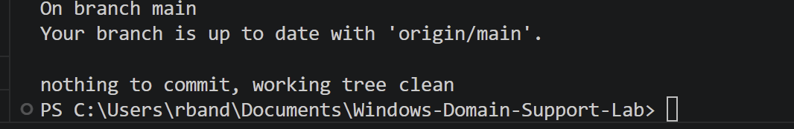

---

## Part 2 — Windows client VM installation

In this part I created and installed the Windows client virtual machine `client-win01`.

The goal of this part was to create a normal Windows client computer that can later be joined to the `bjorklunda.local` Active Directory domain.

### Virtual machine settings

The Windows client VM was created in VMware with the following settings:

| Setting          | Value          |
| ---------------- | -------------- |
| VM name          | `client-win01` |
| Operating system | Windows 11 Pro |
| Memory           | 4096 MB        |
| CPU              | 2 cores        |
| Disk             | 60 GB          |
| Network          | NAT            |

The VM was configured to use NAT networking so it could communicate with the existing lab servers on the VMware NAT network.

The VM was stored outside OneDrive to avoid synchronization problems with large virtual machine files.

### Windows installation

Windows 11 Pro was installed on the client VM.

A local account named `Vulkan` was created during setup. A local account was used first because the machine had not yet joined the local Active Directory domain.

After installation, I verified the client with PowerShell:

```powershell
hostname
whoami
ipconfig /all
```

The command `hostname` showed the computer name:

```text
client-win01
```

The command `whoami` showed the local user:

```text
client-win01\vulkan
```

The command `ipconfig /all` showed that the client received an IP address on the VMware NAT network.

The client network configuration showed:

| Setting                  | Value            |
| ------------------------ | ---------------- |
| IPv4 address             | `192.168.80.133` |
| Subnet mask              | `255.255.255.0`  |
| Default gateway          | `192.168.80.2`   |
| DHCP server              | `192.168.80.254` |
| DNS server before change | `192.168.80.2`   |

At this stage, the client had network connectivity, but DNS still needed to be changed before domain join.

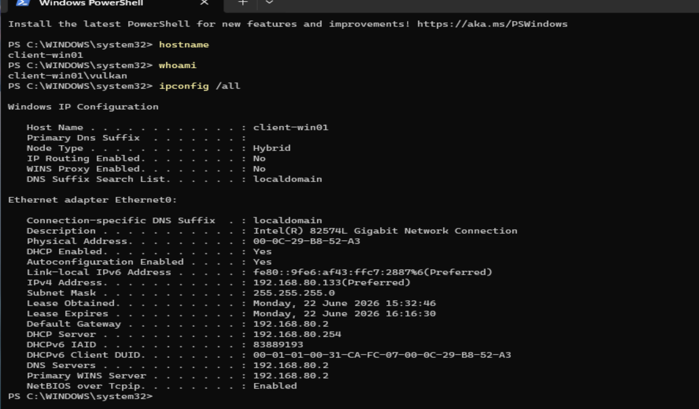

### Part 2 status

Part 2 is completed.

The final result is:

* the Windows client VM `client-win01` was created
* Windows 11 Pro was installed
* a local account was created
* the hostname was verified
* the network configuration was checked
* the client received an IP address on the VMware NAT network

---

## Part 3 — Network and DNS configuration

In this part I configured and verified DNS on `client-win01`.

The goal was to make sure the Windows client could find the domain controller and the `bjorklunda.local` Active Directory domain.

### DNS configuration

The client received its IP address through DHCP, which was acceptable for this lab.

However, Active Directory domain join depends on DNS. The client must use the domain controller as its DNS server so it can find domain services.

The DNS server was changed to:

```text
192.168.80.12
```

This is the IP address of `srv-dc01`, the domain controller and DNS server.

The client kept automatic IP addressing, but the DNS server was set manually.

### DNS and domain controller verification

I verified DNS and domain controller discovery with these commands:

```powershell
nslookup srv-dc01.bjorklunda.local
nslookup -type=SRV _ldap._tcp.dc._msdcs.bjorklunda.local
nltest /dsgetdc:bjorklunda.local
```

The command `nslookup srv-dc01.bjorklunda.local` checks whether the client can resolve the full domain controller hostname.

The command `nslookup -type=SRV _ldap._tcp.dc._msdcs.bjorklunda.local` checks whether the Active Directory LDAP service record exists in DNS. This is important because Windows clients use DNS SRV records to find domain controllers.

The command `nltest /dsgetdc:bjorklunda.local` asks Windows to locate a domain controller for the domain.

The checks confirmed that:

* `srv-dc01.bjorklunda.local` resolved to `192.168.80.12`
* the LDAP SRV record pointed to `srv-dc01.bjorklunda.local`
* `nltest` found the domain controller successfully
* the domain controller was identified as `srv-dc01.bjorklunda.local`

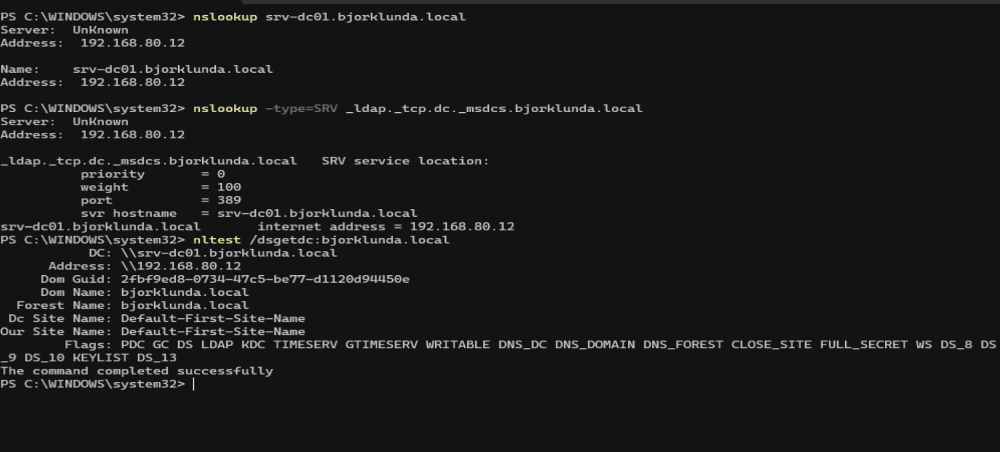

### Part 3 status

Part 3 is completed.

The final result is:

* the client DNS server was set to `192.168.80.12`
* the client could resolve `srv-dc01.bjorklunda.local`
* Active Directory SRV records were found
* `nltest` confirmed that the client could locate a domain controller for `bjorklunda.local`

---

## Part 4 — Domain join

In this part I joined `client-win01` to the `bjorklunda.local` Active Directory domain.

The goal was to make the client a domain-joined workstation so that Active Directory users can log in and access domain resources.

### Domain join attempt

The client was joined to the domain through:

`System > About > Domain or workgroup > Computer Name > Change`

The selected membership type was:

`Domain`

The domain entered was:

```text
bjorklunda.local
```

The first domain join attempt failed with the error:

```text
The specified username is invalid.
```

This happened because the first credential format was not accepted by Windows.

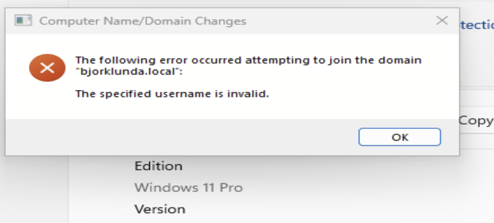

### Successful domain join

The domain join was successful when I used the credential format:

```text
administrator@bjorklunda.local
```

After entering the correct credentials, Windows displayed:

```text
Welcome to the bjorklunda.local domain.
```

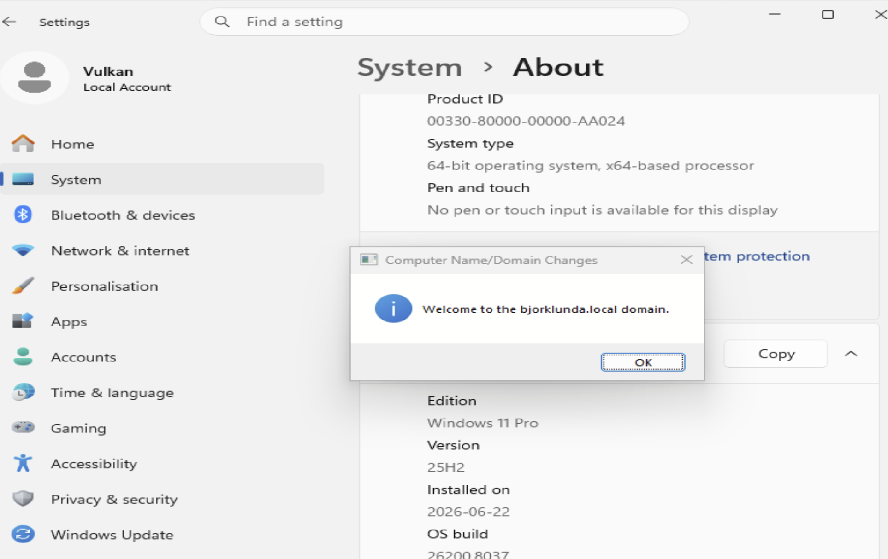

The client was restarted after joining the domain.

### Domain membership verification

After restart, I verified the domain membership with:

```powershell
hostname
whoami
systeminfo | findstr /B /C:"Domain"
```

The command `hostname` confirmed that the client name was still:

```text
client-win01
```

The command `whoami` confirmed which user was logged in.

The command `systeminfo | findstr /B /C:"Domain"` showed that the computer belonged to:

```text
bjorklunda.local
```

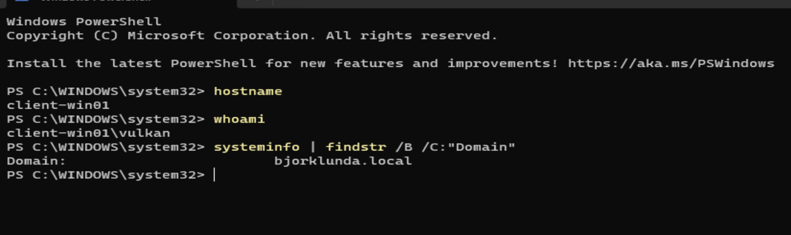

### Part 4 status

Part 4 is completed.

The final result is:

* `client-win01` was joined to `bjorklunda.local`
* the first credential format failed and was documented
* the successful credential format was `administrator@bjorklunda.local`
* the domain join success message was captured
* domain membership was verified after restart

---

## Part 5 — Domain user login testing

In this part I tested logging in to `client-win01` with an Active Directory domain user.

The goal was to prove that a normal domain user can authenticate on the domain-joined client.

### Domain user login

After the client joined the domain, I signed in with the domain user:

```text
bjorklunda\it.user01
```

This user was created earlier in the Björklunda Admin Lab server environment.

After login, I verified the session with:

```powershell
whoami
hostname
systeminfo | findstr /B /C:"Domain"
```

The output showed:

```text
bjorklunda\it.user01
client-win01
Domain: bjorklunda.local
```

This confirmed that the user was logged in with a domain account and that the client was joined to the correct domain.

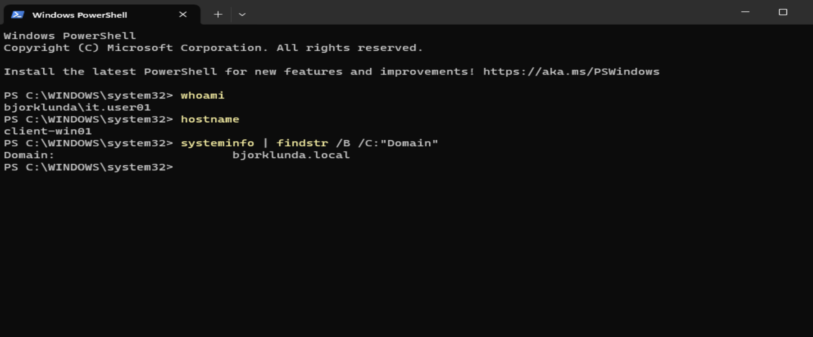

### Part 5 status

Part 5 is completed.

The final result is:

* `bjorklunda\it.user01` could log in to `client-win01`
* `whoami` confirmed the logged-in domain user
* `hostname` confirmed the client computer name
* `systeminfo` confirmed the domain membership

---

## Part 6 — Shared folder access testing and troubleshooting

In this part I tested access to department SMB shares from `client-win01`.

The goal was to prove that Active Directory group-based permissions work from the client side.

The user tested was:

```text
bjorklunda\it.user01
```

This user should have access to the IT share but should not have access to the Finance share.

### IT share access test

While logged in as `bjorklunda\it.user01`, I opened File Explorer and accessed:

```text
\\srv-dc01\IT
```

The IT share opened successfully.

I created a test text file in the IT share with the text:

```text
IT user access test from client-win01
```

This proved that `it.user01` had write access to the IT department share.

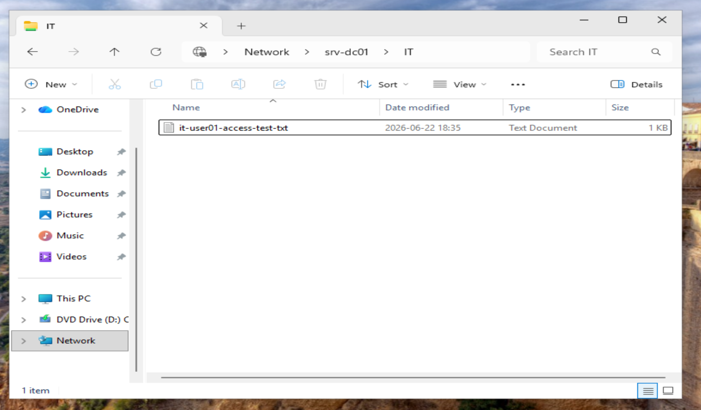

### Unexpected Finance share access

Next, I tested access to:

```text
\\srv-dc01\Finance
```

The expected result was access denied, because `it.user01` should not have Finance access.

However, the Finance share opened successfully. This was an unexpected result and showed that the permissions were too open.


### Checking saved credentials

I checked for cached credentials with:

```powershell
cmdkey /list
```

The command `cmdkey /list` shows saved Windows credentials.

The output did not show saved credentials for `srv-dc01`, `bjorklunda\administrator` or the Finance share. This suggested that the unexpected Finance access was not caused by cached administrator credentials.

### Checking group membership

I checked the current user's group membership with:

```powershell
whoami
whoami /groups
```

The output showed that the current user was:

```text
bjorklunda\it.user01
```

The group list showed:

```text
BJORKLUNDA\GG_IT_Users
```

The user was not a member of:

```text
BJORKLUNDA\GG_Finance_Users
```

This confirmed that the unexpected access was not caused by incorrect group membership.

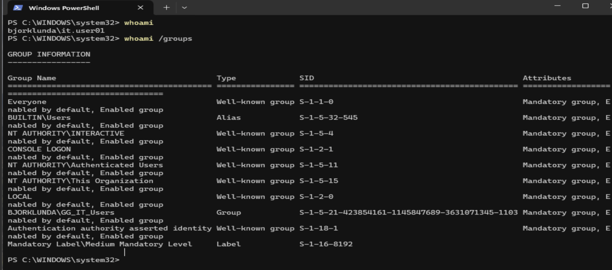

### Checking Finance permissions before fixing

On `srv-dc01`, I checked the Finance folder permissions with:

```powershell
icacls C:\Shares\Finance
Get-SmbShareAccess Finance
```

The command `icacls C:\Shares\Finance` shows NTFS permissions on the Finance folder.

The command `Get-SmbShareAccess Finance` shows SMB share-level permissions.

The output showed that the Finance folder still had broad inherited permissions for `BUILTIN\Users`, and the Finance share had:

```text
Everyone    Allow    Full
```

This explained why `it.user01` could open the Finance share.

### Fixing Finance NTFS permissions

I fixed the Finance NTFS permissions with:

```powershell
icacls C:\Shares\Finance /inheritance:d
icacls C:\Shares\Finance /remove:g "BUILTIN\Users"
icacls C:\Shares\Finance /grant "BJORKLUNDA\GG_Finance_Users:(OI)(CI)(M)"
```

The command `icacls C:\Shares\Finance /inheritance:d` disables inherited permissions while keeping current permissions as explicit entries.

The command `icacls C:\Shares\Finance /remove:g "BUILTIN\Users"` removes the broad local Users group from the Finance folder.

The command `icacls C:\Shares\Finance /grant "BJORKLUNDA\GG_Finance_Users:(OI)(CI)(M)"` grants Modify permission to the Finance security group.

The permission codes mean:

| Code | Meaning                                                  |
| ---- | -------------------------------------------------------- |
| `OI` | Object inherit, files inside inherit the permission      |
| `CI` | Container inherit, folders inside inherit the permission |
| `M`  | Modify permission                                        |

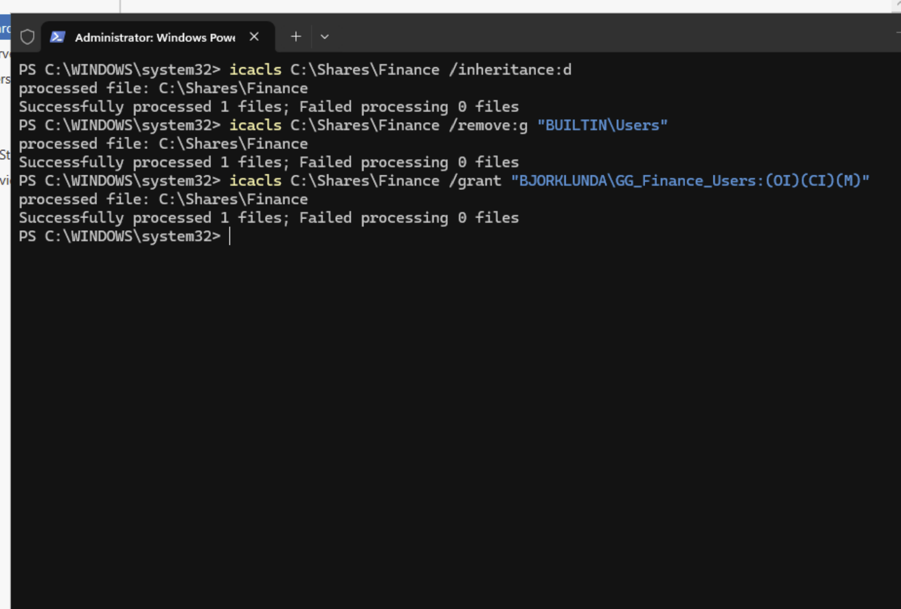

### Fixing Finance SMB share permissions

I fixed the SMB share-level permissions with:

```powershell
Grant-SmbShareAccess -Name Finance -AccountName "BJORKLUNDA\GG_Finance_Users" -AccessRight Change -Force
Revoke-SmbShareAccess -Name Finance -AccountName "Everyone" -Force
```

The command `Grant-SmbShareAccess` gives the Finance group access through the SMB share.

The command `Revoke-SmbShareAccess` removes the broad `Everyone` permission from the share.

### Verifying Finance permissions after fixing

After the changes, I verified permissions again:

```powershell
icacls C:\Shares\Finance
Get-SmbShareAccess Finance
```

The NTFS permissions showed that `BJORKLUNDA\GG_Finance_Users` had Modify permission.

The SMB share access showed:

```text
BJORKLUNDA\GG_Finance_Users    Allow    Change
```

The broad `Everyone` share permission and the broad `BUILTIN\Users` NTFS permission were removed.

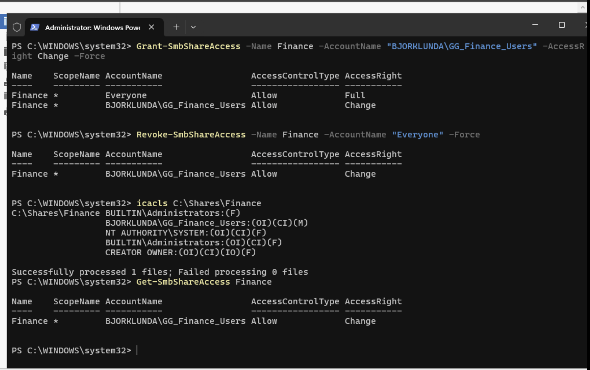

### Finance access denied after fixing

After the permissions were fixed, I tested the Finance share again from `client-win01` while logged in as:

```text
bjorklunda\it.user01
```

I opened:

```text
\\srv-dc01\Finance
```

Windows displayed:

```text
Windows cannot access \\srv-dc01\Finance
You do not have permission to access \\srv-dc01\Finance.
```

This confirmed that the IT user was correctly denied access to the Finance share after the permissions were fixed.

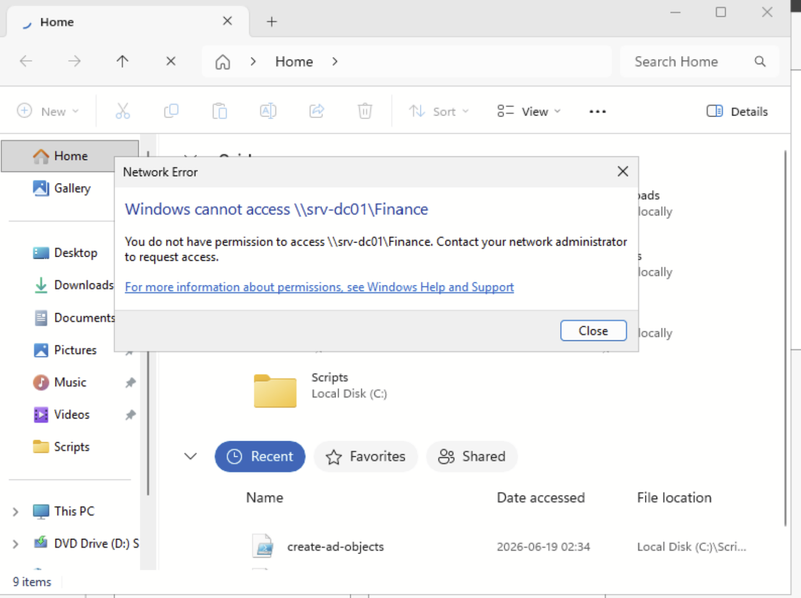

### Part 6 status

Part 6 is completed.

The final result is:

* `it.user01` could access and write to the IT share
* `it.user01` unexpectedly accessed the Finance share
* cached credentials were checked
* group membership was checked
* Finance NTFS and SMB permissions were checked
* broad permissions were found and removed
* Finance access was restricted to `GG_Finance_Users`
* `it.user01` was denied access to Finance after the fix

This part demonstrates client-side file share testing, Active Directory group-based access control, permission troubleshooting, NTFS permissions and SMB share permissions.

---

## Part 7 — Printer connection testing

In this part I tested connecting the domain client `client-win01` to the shared printer hosted on `srv-dc01`.

The goal of this part was to verify that a normal domain user could access a printer shared from the Windows Server print server.

The shared printer used in this test was:

`\\srv-dc01\Bjorklunda-Test-Printer`

### Printer driver prompt

While logged in as the domain user:

`bjorklunda\it.user01`

I opened the shared printer from the print server path:

`\\srv-dc01`

When I clicked the shared printer, Windows displayed a User Account Control prompt for printer driver software installation.

This happened because installing a printer driver requires administrator approval. The normal domain user did not have permission to install the driver without elevation.

I approved the installation with the domain administrator account.


### Shared printer queue

After the printer driver installation was approved, the shared printer queue opened on the client.

The printer queue showed:

`Bjorklunda-Test-Printer on srv-dc01`

This confirmed that the client could connect to the shared printer hosted by the print server.

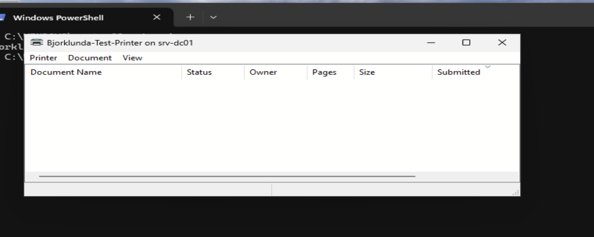

### PowerShell printer verification

I verified the printer connection with PowerShell:

```powershell
Get-Printer
```

The command `Get-Printer` lists printers installed or connected on the Windows client.

The output showed a printer connection to:

`\\srv-dc01\Bjorklunda-Test-Printer`

The printer used the `Generic / Text Only` driver, which was configured earlier on the print server.

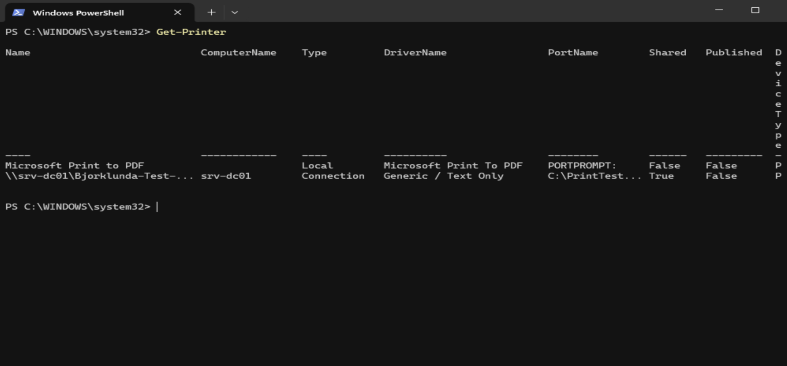

### Printer settings verification

I also verified the printer through the Windows Settings app:

`Settings > Bluetooth & devices > Printers & scanners`

The shared printer was listed as:

`Bjorklunda-Test-Printer on srv-dc01`

This confirmed that the printer connection was visible through the normal Windows user interface.

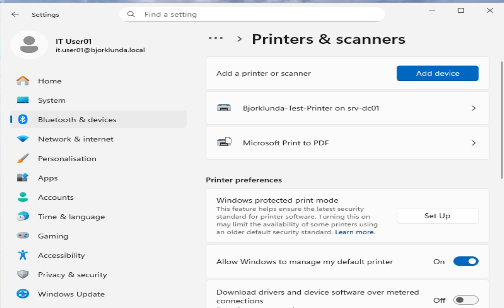

### Part 7 status

Part 7 is completed.

The final result is:

* the domain client could browse the shared printer from `srv-dc01`
* printer driver installation required administrator approval
* the shared printer queue opened successfully
* `Get-Printer` confirmed the printer connection
* Windows Settings showed the shared printer installed on the client

This part demonstrates shared printer access from a domain-joined Windows client and documents the normal user experience when printer driver installation requires administrator credentials.

---

## Part 8 — Basic Group Policy

In this part I created and tested a basic Group Policy Object for the domain user on `client-win01`.

The goal of this part was to show that a setting configured centrally on the domain controller can apply to a domain user on the Windows client.

The policy used in this test was:

`Prohibit access to Control Panel and PC settings`

This policy was chosen because it is safe for the lab and easy to verify from the client side.

### Creating and linking the GPO

On `srv-dc01`, I opened Group Policy Management from:

`Server Manager > Tools > Group Policy Management`

I created a new Group Policy Object and linked it to the `Bjorklunda` OU.

The GPO was named:

`GPO_Block_Control_Panel_For_Users`

Linking the GPO to the `Bjorklunda` OU allows it to apply to the users located under that OU structure.

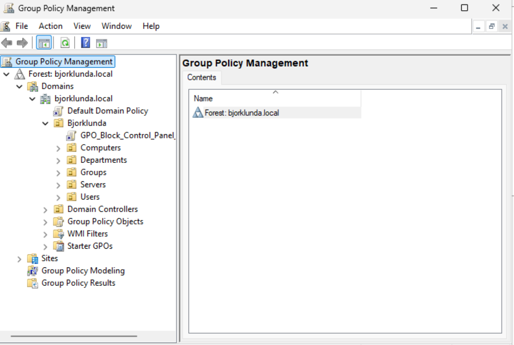

### Enabling the policy setting

I edited the new GPO and navigated to:

`User Configuration > Policies > Administrative Templates > Control Panel`

I enabled the policy:

`Prohibit access to Control Panel and PC settings`

This policy blocks users from opening Control Panel and the Windows Settings app.

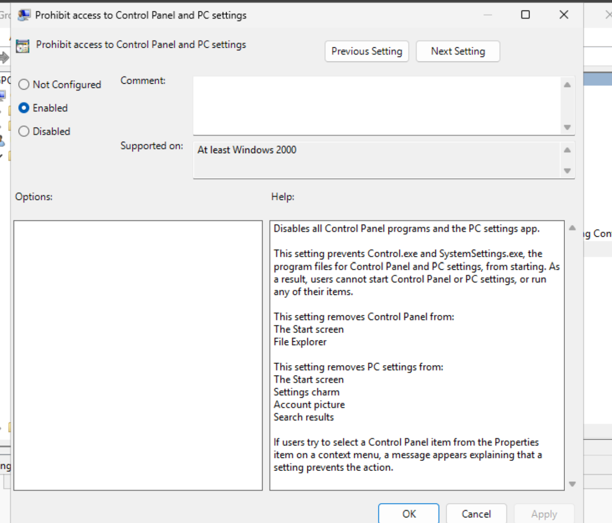

### Updating Group Policy on the client

On `client-win01`, while logged in as:

`bjorklunda\it.user01`

I forced a Group Policy update with:

```powershell
gpupdate /force
```

The command `gpupdate /force` refreshes Group Policy settings from the domain controller and reapplies both computer and user policies.

The update completed successfully.

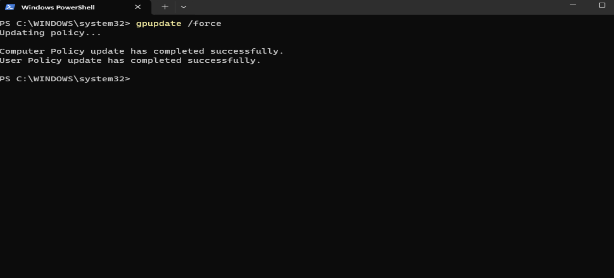

### Testing the blocked Control Panel setting

After the policy update, I tested the restriction by trying to open Control Panel on `client-win01`.

Windows blocked the action and displayed a restriction message. This confirmed that the user policy was applied to the client session.

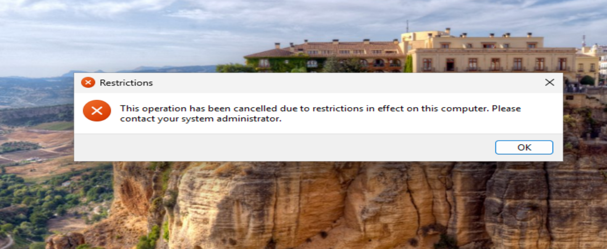

### Verifying the applied GPO with gpresult

I also verified the applied policy with:

```powershell
gpresult /r
```

The command `gpresult /r` shows which Group Policy Objects are applied to the current user and computer.

Under the user settings, the output showed:

`GPO_Block_Control_Panel_For_Users`

This confirmed that the GPO was applied to `bjorklunda\it.user01` on `client-win01`.

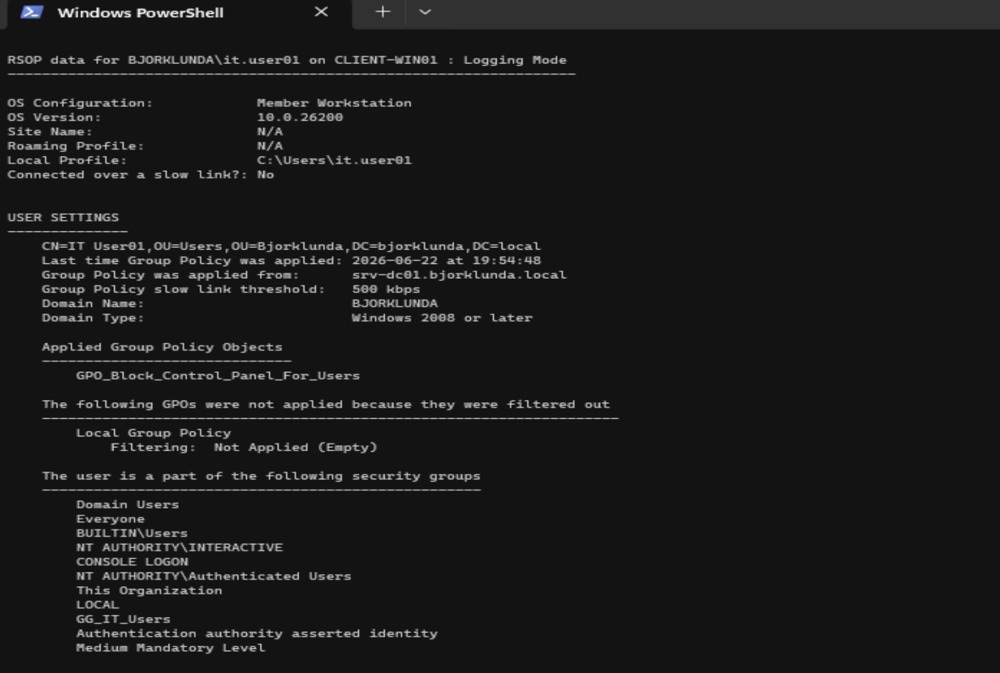

### Part 8 status

Part 8 is completed.

The final result is:

* a new GPO was created on `srv-dc01`
* the GPO was linked to the `Bjorklunda` OU
* the Control Panel and Settings restriction was enabled
* `gpupdate /force` refreshed Group Policy on `client-win01`
* the domain user was blocked from opening Control Panel
* `gpresult /r` confirmed that the GPO applied to `bjorklunda\it.user01`

This part demonstrates basic Group Policy management, central configuration from Active Directory and client-side verification of applied domain policy.
---

## Part 9 — Troubleshooting support cases

In this part I created a support case documentation file for the Windows Domain Support Lab.

The goal of this part was to document realistic client-side troubleshooting cases from a Windows domain environment. Instead of only showing that the lab works, this part explains how common problems can be investigated and solved from an IT support perspective.

The support cases document was created as:

`docs/support_cases.md`

### Purpose of the support cases document

The support cases document describes problems that can happen in a Windows domain environment and explains how an IT technician can troubleshoot them step by step.

The cases are based on the lab environment:

| System | Role |
|---|---|
| `srv-dc01` | Domain controller, DNS server, file server and print server |
| `client-win01` | Domain-joined Windows client |
| `bjorklunda.local` | Active Directory domain |

### Support cases included

The document includes these support cases:

| Case | Topic |
|---|---|
| Case 1 | Client cannot find the domain |
| Case 2 | Domain join fails because username format is invalid |
| Case 3 | IT user can access the IT share |
| Case 4 | IT user unexpectedly accesses Finance share |
| Case 5 | Printer connection requires administrator approval |
| Case 6 | User cannot open Control Panel or Settings |

### Troubleshooting methods documented

The support cases document explains how to use several Windows tools and commands.

Commands included:

```powershell
ipconfig /all
nslookup srv-dc01.bjorklunda.local
nslookup -type=SRV _ldap._tcp.dc._msdcs.bjorklunda.local
nltest /dsgetdc:bjorklunda.local
whoami
whoami /groups
cmdkey /list
icacls C:\Shares\Finance
Get-SmbShareAccess Finance
Get-Printer
gpresult /r
```

The command `ipconfig /all` is used to check IP address, gateway and DNS configuration.

The command `nslookup` is used to test DNS name resolution and Active Directory SRV records.

The command `nltest /dsgetdc:bjorklunda.local` is used to test whether the client can locate a domain controller.

The command `whoami` is used to confirm the currently logged-in user.

The command `whoami /groups` is used to check group membership for the current user.

The command `cmdkey /list` is used to check saved Windows credentials.

The command `icacls` is used to inspect and manage NTFS folder permissions.

The command `Get-SmbShareAccess` is used to inspect SMB share-level permissions.

The command `Get-Printer` is used to verify installed or connected printers.

The command `gpresult /r` is used to check which Group Policy Objects applied to the user and computer.

### Screenshot evidence

I saved a screenshot showing the support cases document in VS Code.

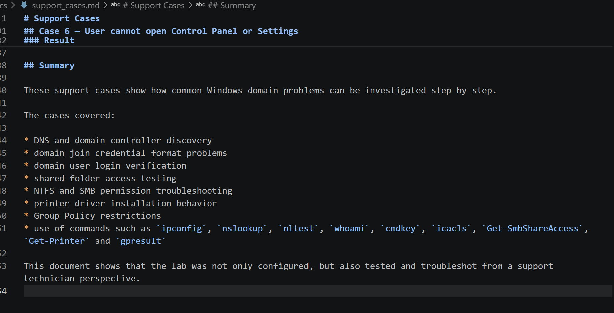

### Part 9 status

Part 9 is completed.

The final result is:

* a support case documentation file was created
* common domain support problems were documented
* DNS and domain join troubleshooting were included
* share permission troubleshooting was included
* printer driver approval behavior was included
* Group Policy restriction troubleshooting was included
* the document shows how an IT technician can investigate problems step by step

This part demonstrates support documentation, troubleshooting structure and practical Windows domain support thinking.

